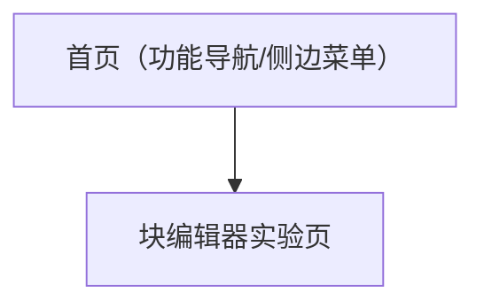

## 1. Product Overview
在现有 React Feature Lab 中新增一个“块编辑器（类 Notion/飞书）”功能页，用于独立学习与调试块级编辑、样式与文档序列化。
核心价值：以可视化、可导入导出的方式验证“Block + Selection Style + Template Blocks”的编辑器能力。

## 2. Core Features

### 2.1 Feature Module
本功能需求由以下页面构成：
1. **首页（功能导航/侧边菜单）**：侧边菜单新增入口、跳转到编辑器实验页。
2. **块编辑器实验页**：编辑区（块级内容）、预设功能块面板、选中后样式修改面板、导入导出。

### 2.3 Page Details
| Page Name | Module Name | Feature description |
|-----------|-------------|---------------------|
| 首页（功能导航/侧边菜单） | 功能入口 | 新增“块编辑器（类 Notion/飞书）”入口；点击后路由跳转至实验页。 |
| 块编辑器实验页 | 页面头部 | 展示页面标题与简要说明；提供导入/导出入口（文件或复制粘贴）。 |
| 块编辑器实验页 | 编辑区（Block 编辑） | 编辑块级内容（如段落/标题/列表等）；支持块内文本编辑与基础快捷键（如回车换行、退格合并等，按编辑器能力落地）。 |
| 块编辑器实验页 | 预设功能块 | 从预设列表插入块到光标位置或当前块下方；预设至少覆盖：标题、段落、待办、引用/Callout、分割线（以“块”为单位）。 |
| 块编辑器实验页 | 选中样式修改 | 当选中一段文本或某个块时，展示可用样式控件；支持修改选中范围的样式（如加粗、斜体、下划线、代码样式、颜色/高亮等，按实现优先级裁剪）。 |
| 块编辑器实验页 | 导入/导出 | 导出当前文档为文件（至少 1 种格式：JSON 或 Markdown）；从文件导入并覆盖当前文档；导入失败时给出错误提示。 |

## 3. Core Process
- 你从首页侧边菜单点击“块编辑器（类 Notion/飞书）”进入实验页。
- 你在编辑区输入内容，通过“预设功能块”快速插入标题/待办/引用等块。
- 你选中某段文本或某个块，在“样式修改”区域调整字体样式或颜色，实时看到效果。
- 你可导出当前文档；也可导入一个文档文件并在页面中还原。

