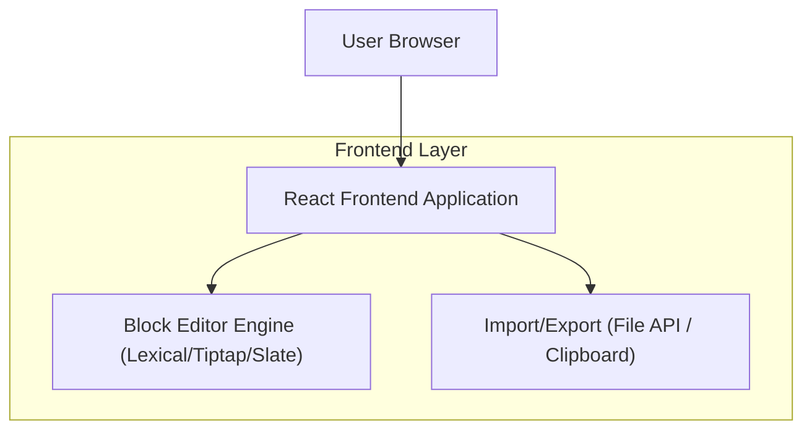

## 1.Architecture design

## 2.Technology Description
- Frontend: React + TypeScript + Vite
- Editor: 选择其一作为“块编辑器内核”（推荐优先评估 Lexical 或 Tiptap/ProseMirror，能覆盖 selection 样式与序列化）
- Styling: CSS Modules（feature 级隔离）
- Backend: None（导入导出使用浏览器 File API；文档数据可先以内存态/本地文件为主）

## 3.Route definitions
| Route | Purpose |
|-------|---------|
| / | 首页（功能导航/侧边菜单），包含本功能入口 |
| /features/notion-editor | 块编辑器实验页（类 Notion/飞书），用于块编辑/样式/导入导出 |
